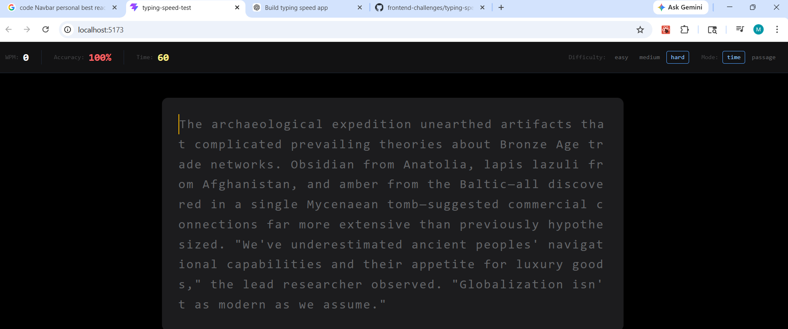

# ⌨️ Personal Best - Minimalist Typing Speed Test

A high-performance, minimalist typing speed test application built with **React**, **Vite**, and **Tailwind CSS**. Inspired by Monkeytype, this app focuses on a clean user interface and smooth typing experience.


## 🚀 Features

- **Live Stats**: Real-time WPM (Words Per Minute), Accuracy, and Timer tracking.
- **Dynamic Content**: Passages are dynamically fetched from a JSON database based on selected difficulty.
- **Multiple Modes**: Support for "Time-based" challenges and "Passage-based" practice.
- **Difficulty Levels**: Choose between Easy, Medium, and Hard to test your limits.
- **Visual Feedback**: Real-time character highlighting (Green for correct, Red for errors).
- **Responsive Design**: Fully optimized for various screen sizes using Tailwind CSS.
- **Professional Workflow**: Built using a feature-branch Git workflow.

## 🛠️ Tech Stack

- **Frontend**: React.js (Hooks, Context API)
- **Bundler**: Vite
- **Styling**: Tailwind CSS
- **Data**: Local JSON Storage
- **State Management**: React useState & useEffect


## 🚀 Live Demo
Check out the live application here: [Personal Best - Typing Speed Test](https://frontend-challenges-psi-ochre.vercel.app/)

## 📸 Screenshot



## 📦 Installation & Setup

1. **Clone the repository**:
   ```bash
   git clone https://github.com/meena-purohit/frontend-challenges 
   ```

2. **Navigate to the project directory**:
   ```bash
   cd personal-best-typing
   ```

3. **Install dependencies**:
   ```bash
   npm install
   ```

4. **Run the development server**:
   ```bash
   npm run dev
   ```

## 🎯 Challenges & Learnings

- **Precise Timing**: Implementing a reliable timer that triggers exactly on the first keystroke.
- **Hidden Inputs**: Managing focus on a hidden `textarea` to ensure a seamless typing experience without distracting UI elements.
- **Dynamic Styling**: Creating a sophisticated text-rendering logic to handle character-by-character color updates and cursor animations.

## 🚧 Upcoming Features

- [ ] Personal Best (LocalStorage) persistence.
- [ ] Final Results Modal with detailed analytics.
- [ ] Sound effects for mechanical keyboard feel.
- [ ] Dark/Light mode toggle.

## 📄 License

Distributed under the MIT License. See `LICENSE` for more information.

---
**Developed with ❤️ by [Meena Purohit]**
